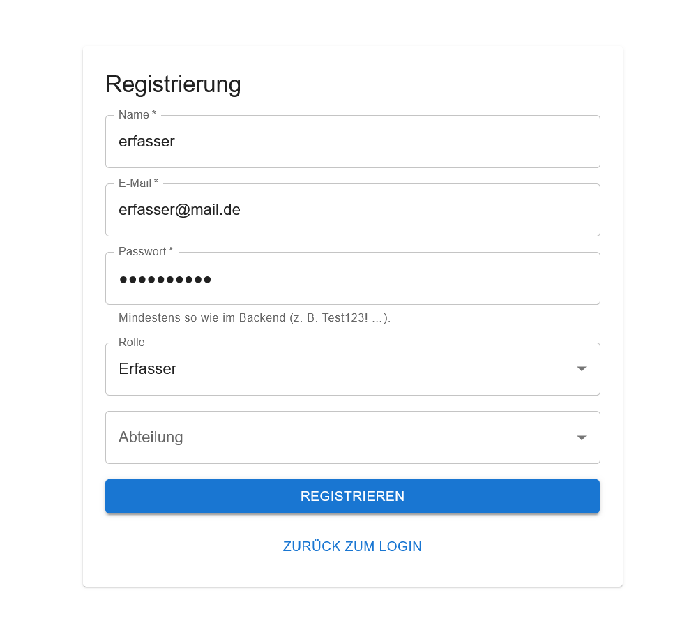
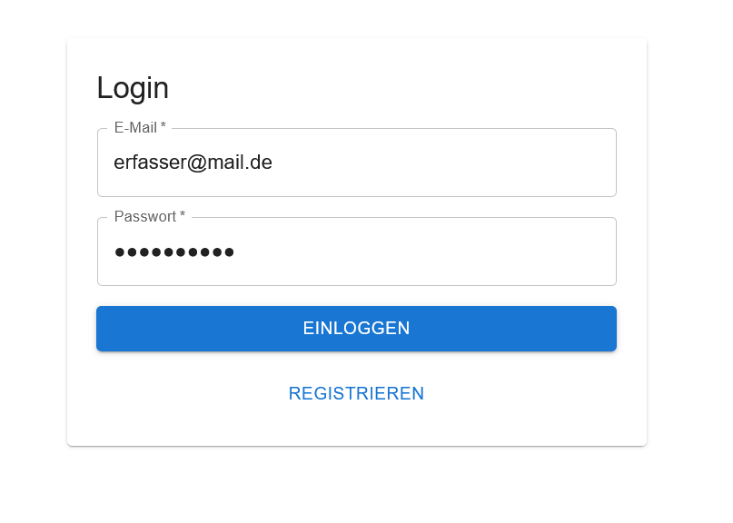
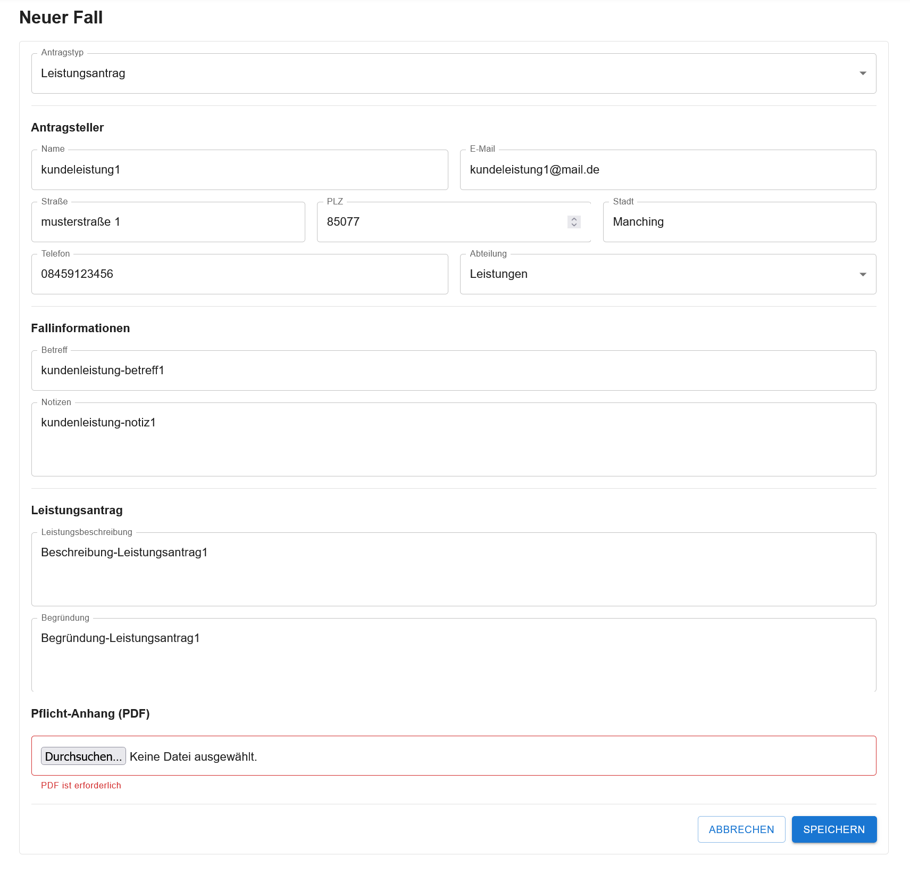
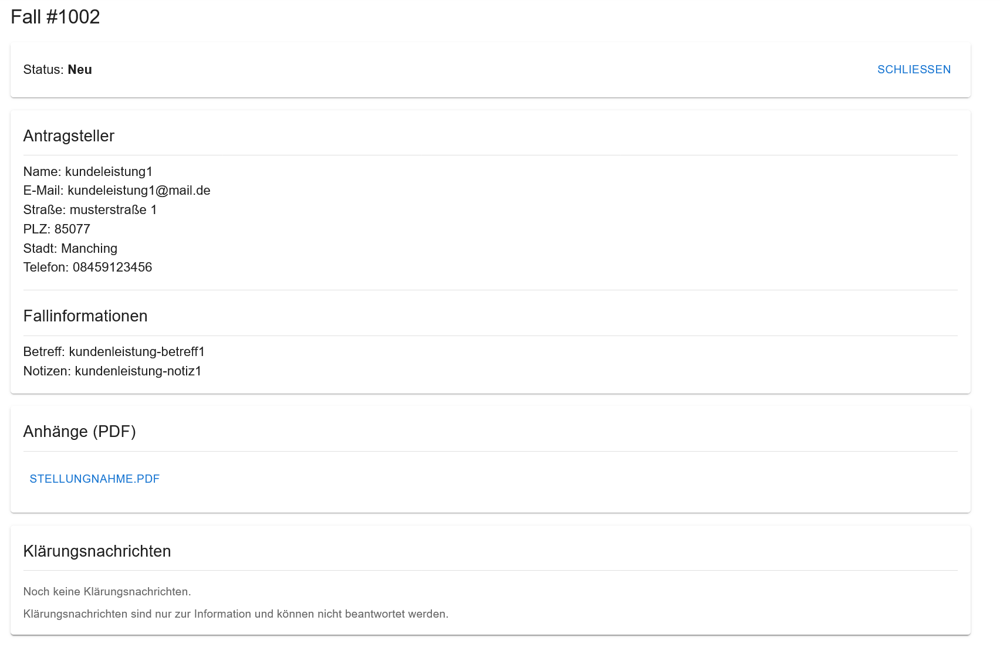
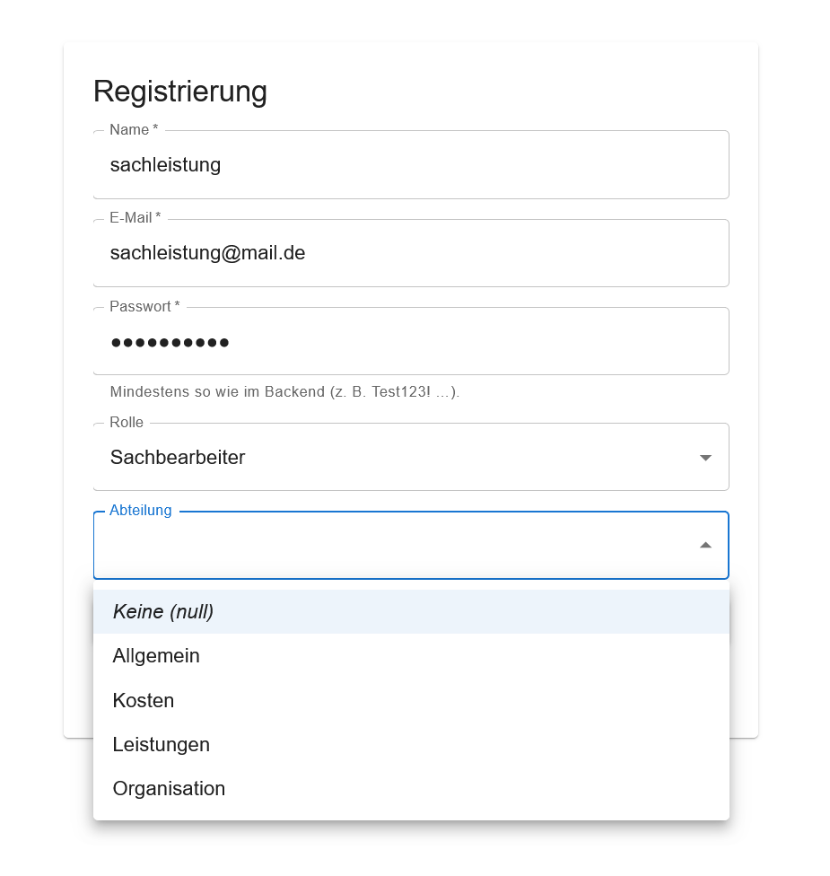
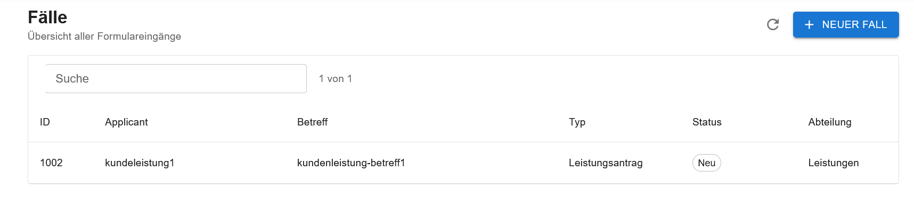
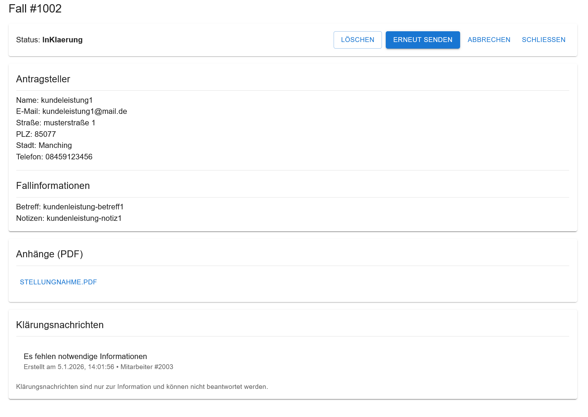
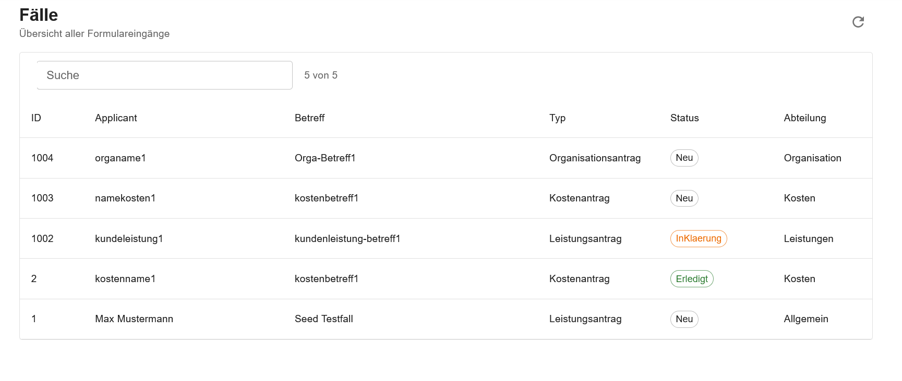

# CaseFlow - Fallmanagement-Workflow-System

CaseFlow ist eine Webanwendung zur Abbildung eines realistischen administrativen Fallbearbeitungs‑Workflows mit klaren Statusübergängen, rollenbasierter Berechtigung und Dokumentenverwaltung (PDF‑Anhänge).
Der Fokus liegt Layered‑Architektur, Geschäftslogik und nachvollziehbaren Berechtigungsregeln.

1. [Über das Projekt](#über-das-projekt)
2. [Features](#features)
3. [Architektur](#architektur)
4. [Technologiestack](#technologiestack)
5. [Quickstart](#quickstart)
6. [Screenshots](#screenshots)
7. [Motivation & Lernziele](-motivation--lernziele)
8. [Autor](#autor)

## Über das Projekt
CaseFlow simuliert einen typischen behördlichen oder unternehmensinternen Prozess zur Bearbeitung von Fällen, bei dem mehrere Rollen mit klar getrennten Verantwortlichkeiten zusammenarbeiten.

Zentrale Aspekte des Systems sind:
- Trennung zwischen Fall-Erfassung und Fall-Bearbeitung
- Strikt definierte Statusübergänge
- Serverseitige Durchsetzung von Rollen‑ und Zugriffsregeln
- Nachvollziehbare und testbare Geschäftslogik

Das Projekt wurde als Bewerbungs‑ und Lernprojekt umgesetzt und orientiert sich bewusst an realistischen Anforderungen aus der Praxis.

## Features
### Fallverwaltung
- Erstellen, Anzeigen, Bearbeiten und Löschen von Fällen
- Zuordnung eines Falls zu einer Abteilung
- Klare Trennung zwischen Fallbesitzer (Erfasser) und bearbeitender Rolle (Sachbearbeiter)

### Status-Workflow
Ein Fall durchläuft definierte Bearbeitungszustände:
- Neu
- In Bearbeitung
- In Klärung
- Abgeschlossen

Statusübergänge sind abhängig von Rolle und aktuellem Zustand und werden ausschließlich serverseitig validiert

### Rollen & Berechtigungen
- JWT-basierte Authentifizierung
- Rollenbasierte Autorisierung (Claims)
- Trennung von Authentifizierung (401) und fehlender Berechtigung (403)

### Dokumente / PDF-Anhänge
- Upload von Dokumenten zu einem Fall
- Download vorhandener Anhänge

```
stateDiagram-v2
    [*] --> Neu

    Neu --> InBearbeitung : Sachbearbeiter
    InBearbeitung --> InKlaerung : Sachbearbeiter
    InBearbeitung --> Erledigt : Sachbearbeiter

    InKlaerung --> Neu : Erfasser (Fallbesitzer)

    Erledigt --> [*]
```
  
## Architektur

<p align="center">

</p>

```
RoomBooking.Web                → Controller, Endpoints, Program/DI, DTOs, Mapping
RoomBooking.Application        → Services, Interfaces
RoomBooking.Infrastructure     → EF Core, Identity, DB-Kontext
RoomBooking.Domain             → Domain Modelle
```
Die Architektur folgt dem Prinzip: Abhängigkeiten zeigen nach innen.
Geschäftsregeln befinden sich ausschließlich in den Services(Application-Schicht) und nicht in Controllern oder im Frontend.

## Technologiestack
### Backend
- C# / .NET
- ASP.NET Core Web API
- Entity Framework Core
- ASP.NET Identity
- JWT-Authentifizierung
- Docker & Docker Compose
- xUnit

### Frontend
- React
- Vite
- Material UI
- Axios

### Datenbank
- SQL Server

## Quickstart (Docker Compose)
### Projekt klonen
```
git clone https://github.com/michaelbannach/CaseFlow.git
cd CaseFlow
```

### Backend starten
```
docker compose up --build
```

### Frontend starten
```
cd frontend
npm run dev
```

## Screenshots





Der Erfasser erstellt einen neuen Antrag
Erfasser kann für alle Abteilungen Anträge erstellen






Sachbearbeiter sieht nur Anträge seiner Abteilung


Bearbeitung durch Sachbearbeiter
Bei Unklarheiten kann das Formular an den Erfasser zurückgesendet werden mit erzwungener Notiz


Dieses Formular erscheint mit Status `In Klärung` bei dem Erfasser


Mitarbeiter des Stammdaten-Bereichts sehen Anträge aller Abteilungen



## Motivation
Ziel dieses Projekts war es, einen praxisnahen Use Case umzusetzen, der typische Anforderungen aus dem Unternehmensalltag abbildet, 
um beim späteren Einstieg in ein Unternehmen auf vorhandene praktische Kenntnisse aufbauen zu können.

- Abbildung eines realistischen Workflows mit klarer Statuslogik
- Korrekte Umsetzung von Rollen- und Berechtigungskonzepten
- Aufbau einer wartbaren und erweiterbaren Backend-Architektur

## Autor

**Name:** Michael Bannach
**Rolle:** angehender Softwareentwickler
